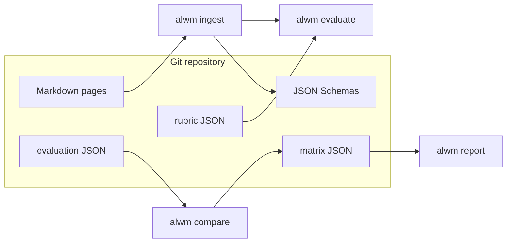

# Current architecture

_Last updated: 2026-04-17 (governance + browser docs alignment)._

## Summary

The repository is a **docs-first** workspace for an LLM wiki and comparison matrix, with a Python orchestration package and Docker-based build/run tooling. Phases 1–3 delivered schemas, fixtures, validation, and **provider adapters** (mock, Ollama, OpenAI-compatible HTTP). **Phase 4** adds **offline pipelines**: Markdown **ingest**, deterministic **evaluate**, evaluation **compare** (matrix JSON + optional matrix Markdown), and **report** rendering from templates.

## Components

| Component | Status | Notes |
| --- | --- | --- |
| CLI (`alwm`) | Implemented | Core: `version`, `info`, `validate`, `ingest`, `evaluate`, `compare`, `report`. Benchmarks: `benchmark run`, `benchmark probe`. Prompts: `prompts check`, `list`, `show`. Providers: `providers show`. Browser: `browser prompt-block`, `run-mock`, `run-playwright` (Playwright requires optional `[browser]` extra) |
| JSON Schema + Pydantic | Implemented | Thought, Event, Experiment, Evaluation, Matrix, Report, **Rubric**, **BenchmarkResponse** |
| Wiki `WikiNote` schema | Implemented | `note.schema.json`; examples still JSON-only |
| Prompt registry | Implemented | `prompts/registry.yaml` + `alwm prompts check|list|show`; schema `schemas/v1/prompt_registry.schema.json` |
| Markdown templates | Implemented | `templates/matrix.md`, `templates/report.md`, weekly stub |
| Provider layer | Implemented | Mock / Ollama / OpenAI-compatible HTTP; YAML/env config |
| Pipelines | Implemented | Ingest → evaluate → compare → report; **benchmark run** (responses → evals → grid + pairwise matrices + report) |
| Browser evidence layer | Implemented | **Offline:** `MockBrowserRunner`, `FileBrowserRunner`, JSON fixtures. **Optional live:** `PlaywrightBrowserRunner` (`[browser]` extra). **Stub:** `MCPBrowserRunner` only |

## Runtime

- **Local:** Python 3.11+ (`pyproject.toml`); `just ci` for lint, typecheck, tests.
- **Container:** `Dockerfile` `runtime` target: non-root `alwm` image; `test` target: editable install + pytest for the Compose **test** profile.
- **Compose:** `dev` (`orchestrator`), `test` (`tests`), `benchmark` (`benchmark` → `alwm info` smoke).
- **Build:** `docker buildx bake` defaults to `linux/amd64` and `linux/arm64`; `orchestrator-amd64` / `orchestrator-arm64` for single-arch builds.

## Data flow (today)

## Testing

- Pytest covers smoke tests, all v1 fixtures (including rubric), matrix dimension validation, CLI `validate`, and pipeline unit tests.
- No live network tests by default.
