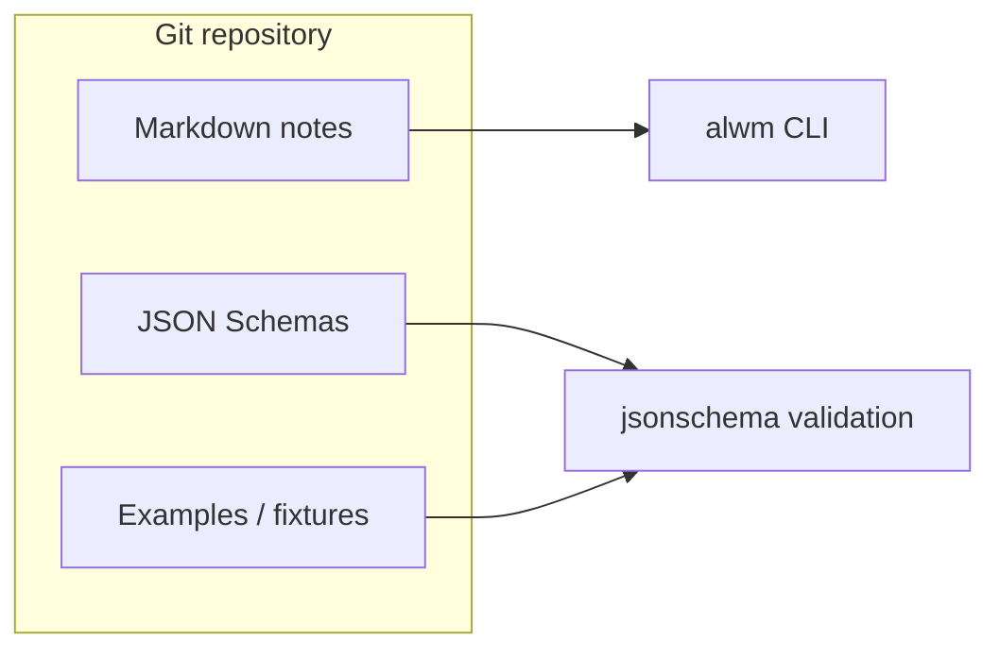

# Current architecture

_Last updated: 2026-04-17 (Phase 1)._

## Summary

The repository is a **docs-first** workspace for an LLM wiki and comparison matrix, with a small Python orchestration package and Docker-based build/run tooling. Phase 1 established layout, CLI, schema validation, multi-arch bake targets, and Compose profiles without implementing full evaluation or provider stacks.

## Components

| Component | Status | Notes |
| --- | --- | --- |
| CLI (`alwm`) | Implemented | `version`, `info`; structured logging via structlog |
| JSON Schema validation | Implemented | Draft 2020-12; load by repo-relative path; cache keyed by absolute schema path |
| Prompt registry | Skeleton | `prompts/registry.yaml` + versioned text files |
| Markdown templates | Skeleton | `templates/report-weekly.md` |
| Provider layer | Not implemented | Planned: mock, Ollama, OpenAI-compatible HTTP (Phase 3) |
| Ingest / evaluate / matrix | Not implemented | Phases 4–5 |
| Browser evidence layer | Not implemented | Mock + file fixtures planned |
| Ollama / model Compose services | Commented placeholder | Phase 6 |

## Runtime

- **Local:** Python 3.11+ (`pyproject.toml`); `make ci` for lint, typecheck, tests.
- **Container:** `Dockerfile` produces non-root `alwm` image; Compose mounts repo at `/workspace` for dev/test/benchmark profiles.
- **Build:** `docker buildx bake` defaults to `linux/amd64` and `linux/arm64`; `orchestrator-amd64` / `orchestrator-arm64` for single-arch builds.

## Data flow (today)

Full ingest → evaluate → compare → summarize pipelines are not yet wired.

## Testing

- Pytest smoke tests for CLI and schema validation.
- No live network tests by default; use `ALWM_FIXTURE_MODE` for future deterministic modes (Phase 6+).
