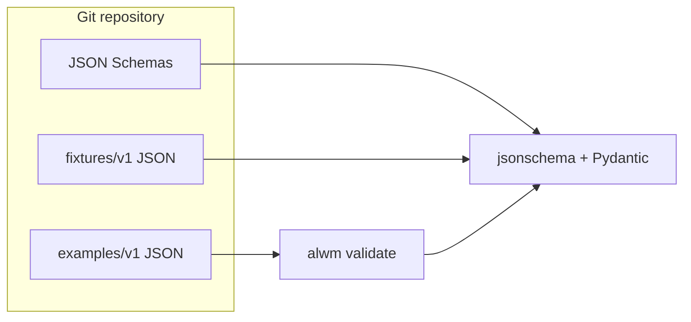

# Current architecture

_Last updated: 2026-04-17 (Phase 3)._

## Summary

The repository is a **docs-first** workspace for an LLM wiki and comparison matrix, with a Python orchestration package and Docker-based build/run tooling. Phases 1–2 delivered schemas, fixtures, and validation; **Phase 3** adds **provider adapters** (mock, Ollama, OpenAI-compatible HTTP) with YAML/env configuration and **`alwm providers show`**.

## Components

| Component | Status | Notes |
| --- | --- | --- |
| CLI (`alwm`) | Implemented | `version`, `info`, `validate` |
| JSON Schema + Pydantic | Implemented | Thought, Event, Experiment, Evaluation, Matrix, Report |
| Wiki `WikiNote` schema | Implemented | `note.schema.json`; examples still JSON-only |
| Prompt registry | Skeleton | `prompts/registry.yaml` |
| Markdown templates | Skeleton | `templates/*.md` plus weekly report stub |
| Provider layer | Implemented (adapters) | Mock / Ollama / OpenAI-compatible HTTP; no benchmark wiring yet |
| Pipelines (ingest/evaluate) | Not implemented | Phases 4–5 |
| Browser evidence layer | Not implemented | Planned: mock + fixtures |

## Runtime

- **Local:** Python 3.11+ (`pyproject.toml`); `make ci` for lint, typecheck, tests.
- **Container:** `Dockerfile` produces non-root `alwm` image; Compose mounts repo at `/workspace` for dev/test/benchmark profiles.
- **Build:** `docker buildx bake` defaults to `linux/amd64` and `linux/arm64`; `orchestrator-amd64` / `orchestrator-arm64` for single-arch builds.

## Data flow (today)

## Testing

- Pytest covers smoke tests, all v1 fixtures, matrix dimension validation, and CLI `validate`.
- No live network tests by default.
