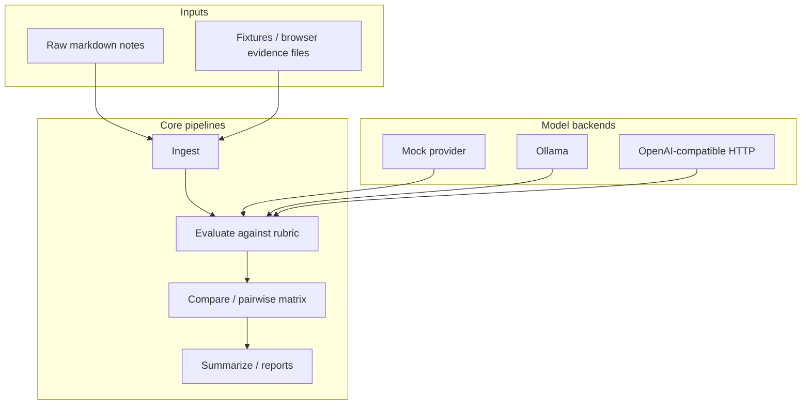

# Target architecture

_Last updated: 2026-04-17 (aligned with Phase 1 roadmap)._

## Vision

A **markdown-first, git-native** system that stores ideas, experiments, evaluations, prompts, and reports as structured, validated artifacts. It produces **pairwise comparison matrices**, **weighted scores**, and **weekly reports**, with **reproducible** pipelines for ingest, evaluate, compare, and summarize across **browser**, **CLI**, and **repository-governed** workflows.

## Target components

| Layer | Responsibility |
| --- | --- |
| **Schemas** | JSON Schema for thought, event, experiment, evaluation, matrix, report, and registry objects |
| **Prompt registry** | Versioned prompts with semver-style IDs and validation |
| **Providers** | `BaseProvider` with `OllamaProvider`, OpenAI-compatible (llama.cpp) HTTP, and `MockProvider` |
| **Browser evidence** | Abstraction over captured traces/screens; mock + file-backed fixtures first |
| **Pipelines** | Ingest raw markdown → structured records → rubric evaluation → persisted evaluations → matrices |
| **Reporting** | Weekly summaries; model/provider comparisons; agent-stack comparisons; browser-evidence comparisons |
| **Orchestration** | Docker Compose profiles: `dev`, `test`, `benchmark`; optional Ollama service; volume layout for data/cache |
| **Build** | Docker Buildx Bake: `linux/amd64` + `linux/arm64` default; extension points for other ARM variants only when tested |

## Target data flow

## Non-goals (near term)

- Assuming **arm/v7** compatibility without explicit images and tests.
- Hard-coding vendor APIs without adapter interfaces and mocks.

## Phasing

See `docs/implementation-log.md` for completed work and upcoming phases (2–7).
